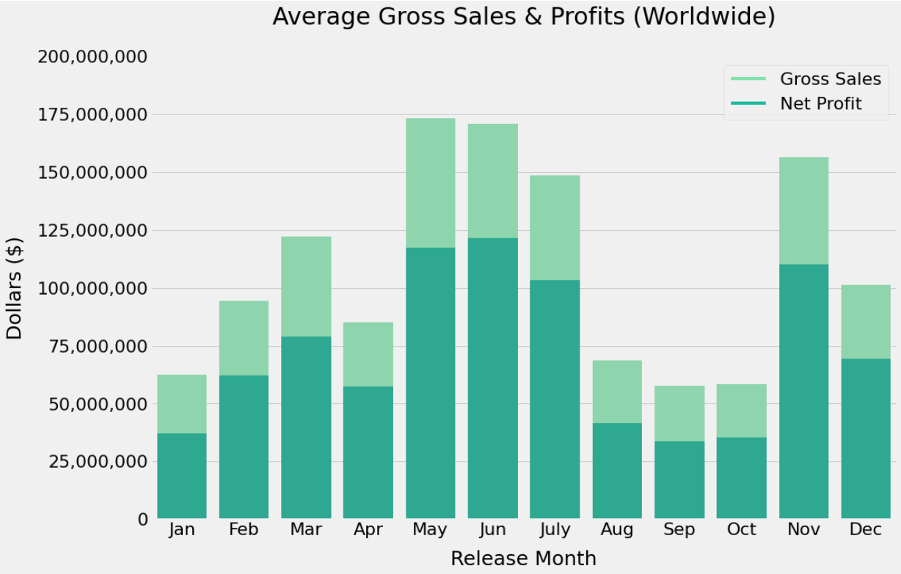
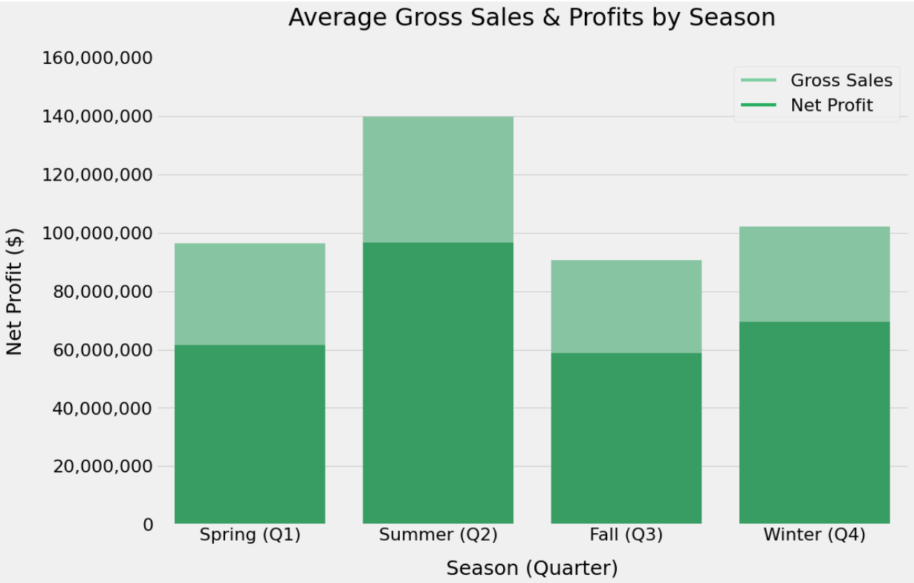
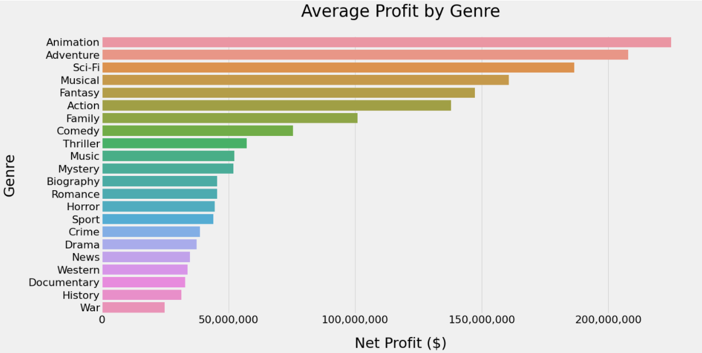
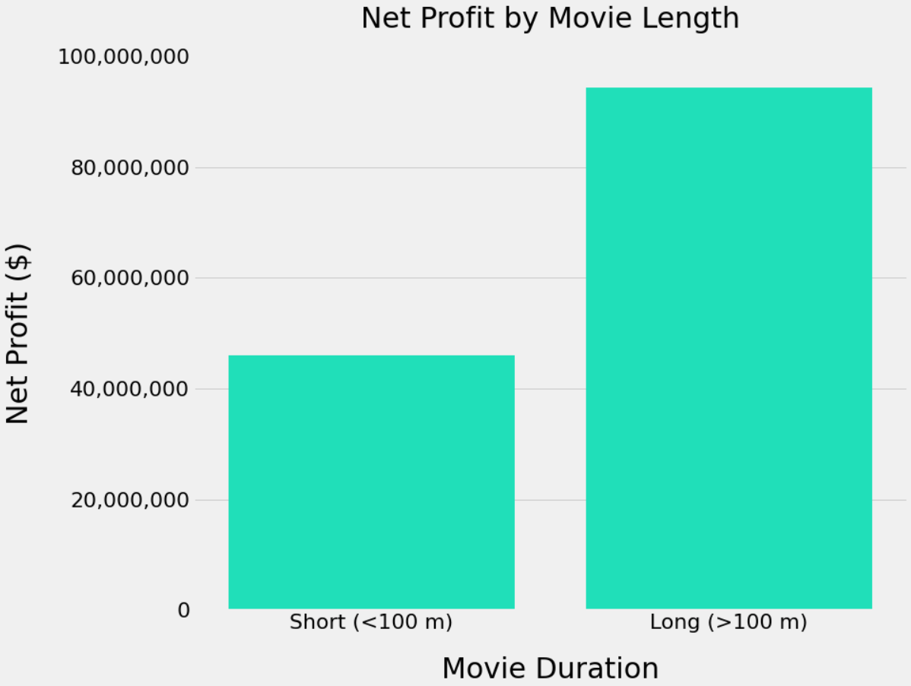

# Microsoft Goes to the Movies - A Data-Driven Approach to the Movie Industry

**Author**: [Chris Choi](mailto:chris@choi.is)

## Overview

This project analyzes key trends in the global movie industry for a hypothetical situation in which[Microsoft](https://www.microsoft.com) seeks to start a successful movie studio. Descriptive analysis of online movie databases shows that the time of year the movie is released as well as its genre and duration are key factors predicting high gross sales and profits. The hypothetical Microsoft Movie Studio can use this analysis to optimize production parameters as well as distribution and marketing strategies to increase the probability for success at the box office.

## Business Problem

Microsoft Movie Studio may be able to improve resource allocation and decision-making for its movie studio in terms of critical production parameters such as choice of genre and duration. Additionally, data analysis can help guide distribution and marketing decisions such as what time of year to release the movie. Doing so will reduce the probability of making costly mistakes such as investing heavily in a movie production only to, say, release it in the off-season. 

## Data

This project uses datasets derived from the popular movie websites IMDb.com (Internet Movie Database) and The-Numbers.com. The data files collectively provide the title, release date, production budget, domestic and global sales, and other relevant figures for thousands of movies released from 1915 to 2019.

## Methods

This project uses descriptive analysis, including description of trends over time and by category. The products of this analysis provide a useful overview of the movie industry's key consumer trends and preferences. 

## Results

The best selling and most profitable months of the year are May, June, July, and November. The worst performing months of the year are the fall months (Aug, Sep, Oct) and January. Notably, the ratio between production budget and gross sales remains relatively constant.



This chart is similar to the previous chart, except it groups the average movie sales by seasons/quarters instead of months. The summer season (Q2) is by far the best performing season in terms of revenues and profits, followed by winter (Q4). Spring (Q1) and fall (Q2) are virtually identical.



The most profitable genres (defined here as earning over 100 M in profit) are Animation, Adventure, Sci-Fi, Musical, Fantasy, Action, and Family. The two most profitable genres are Animation and Adventure with over 200 M in profit. The least profitable genres are War, History, Documentary, Western and News.



The median runtime value is found (100 minutes) and used to divide the dataset into two bins: short and long. The average short movie vs. the average long movie are then compared. Long movies (duration > 100 minutes) are almost twice as profitable as short movies (duration < 100 minutes). 



## Conclusions

The results of this data analysis project leads to three key actionable insights for Microsoft to achieve financial success in the global movie industry:

- **Target the summer months (and November).** These four months exhibit unusually high sales numbers: May, June, July, and November. As a result, Microsoft should target these months for new movie releases as the data suggests consumer activity is elevated during these months. The months of August, September, and October should conversely be avoided unless a more advanced/targeted business strategy is being considered.
- **Aim for fictional genres with escapist content; avoid non-fiction** The most profitable genres are Animation, Adventure, Sci-Fi, Musical, Fantasy, Action, and Family. The least profitable are War, History, Documentary, Western and News. This analysis suggests Microsoft should release fiction movies with elaborate narratives, production sets and special effects, as they appear more likely to draw large audiences.
- **Longer movies are more profitable.** Movies with a duration above the median (100 minutes) achieve returns almost twice that of shorter duration movies (under 100 minutes).
- **OVERALL:** Microsoft should focus on releasing longer-than-average features and should explore franchises with deep casts and long storylines that can be extended over multiple releases. 

### Next Steps

Further analyses could yield additional insights to further improve sales and profit projections:

- **Conduct a more fine-grained analysis of release time data.** See if a pattern can be observed within the most profitable months, such as whether certain weeks within May, June, July, and November tend to outperform others, or if a mid-week release schedule is better than an end-of-week schedule.
- **Further explore the relationship between release time, genre, and length.** For example, do the summer month movies perform better because they tend to represent the most profitable genres and have greater durations? 
- **Model impact of franchise status on profit measures.** Movie franchises, particularly those based on the most popular genres and released in the busy season, may exhibit greater profitability than one-off movies.

## For More Information

See the full analysis in the [Jupyter Notebook](./movie_industry_analysis.ipynb) or review this [presentation](./movie_industry_presentation.pdf).

For additional info, contact Chris Choi at [chris@choi.is](mailto:chris@choi.is)


## Repository Structure

```
├── data
├── images
├── README.md
├── movie_industry_presentation.pdf
├── movie_industry_analysis.ipynb
├── budgets_genre_df.csv
```